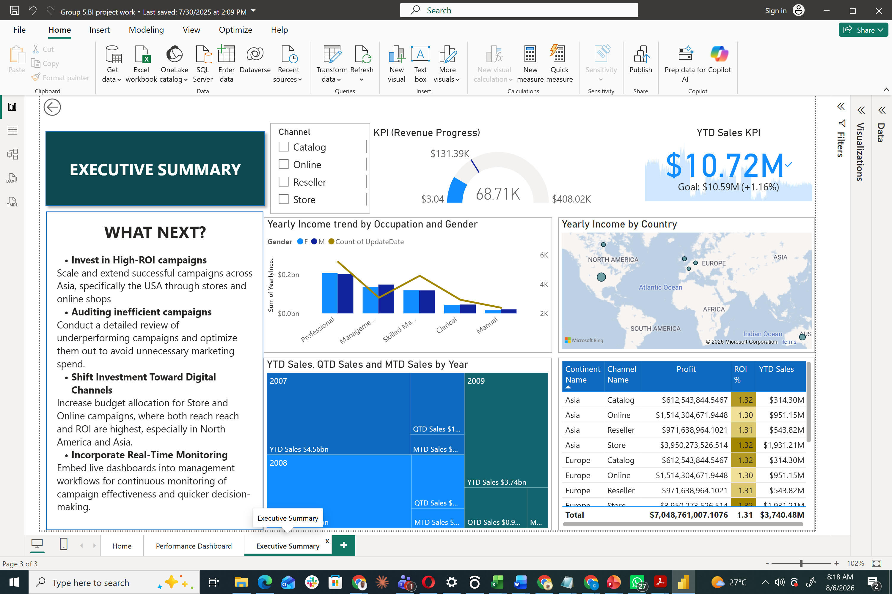
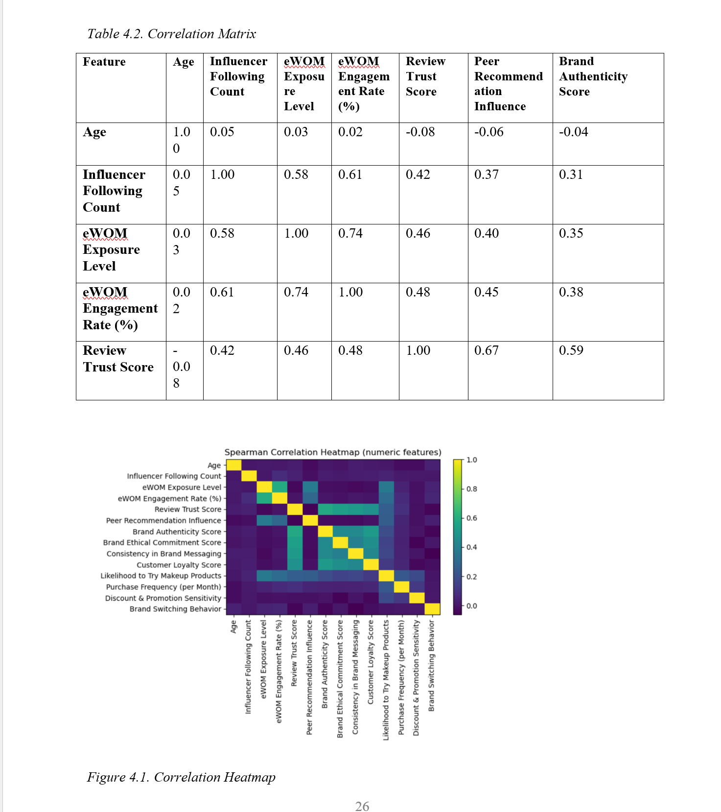
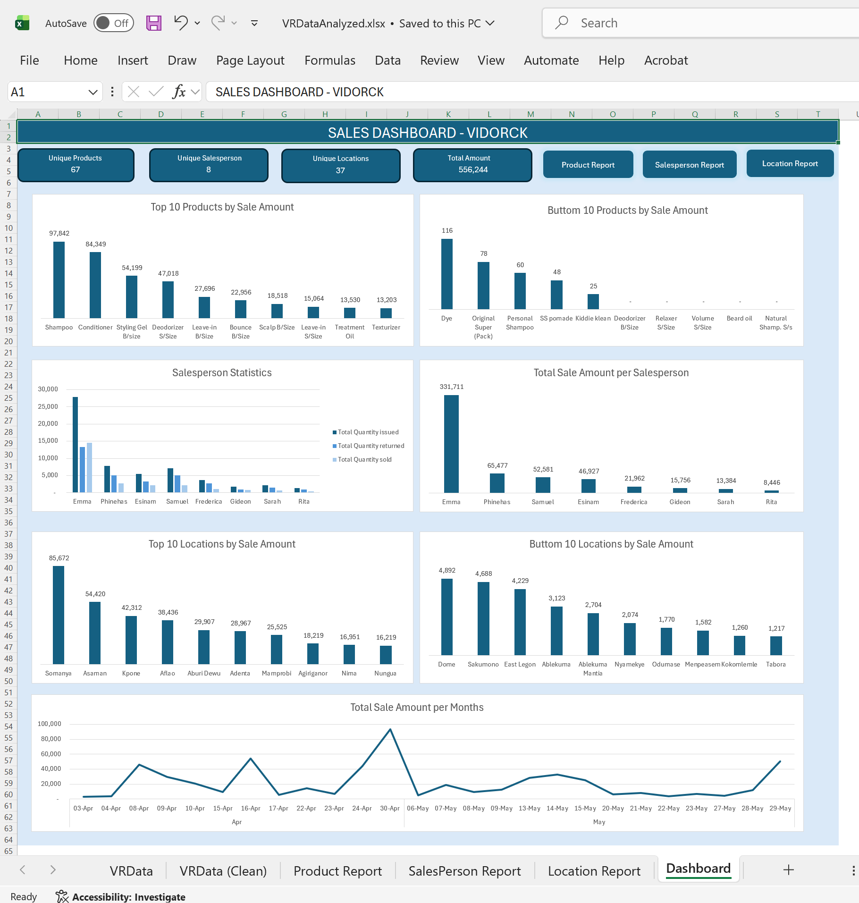
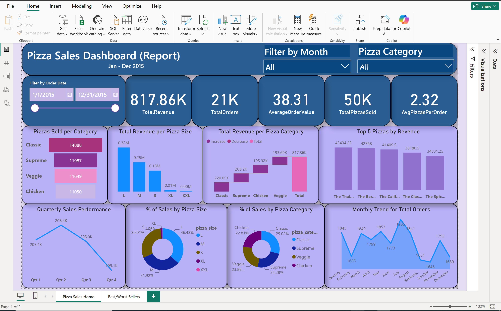
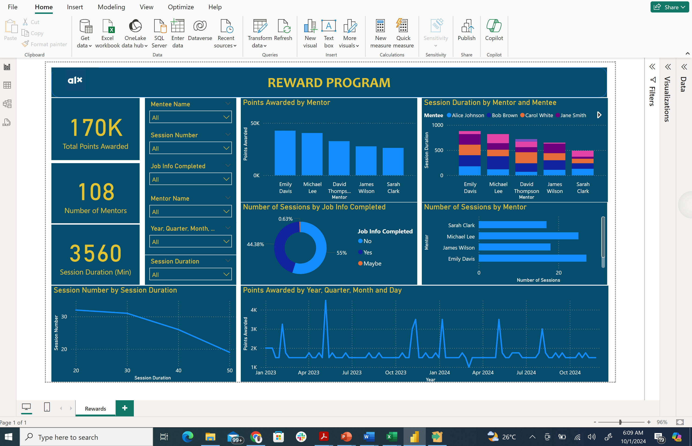
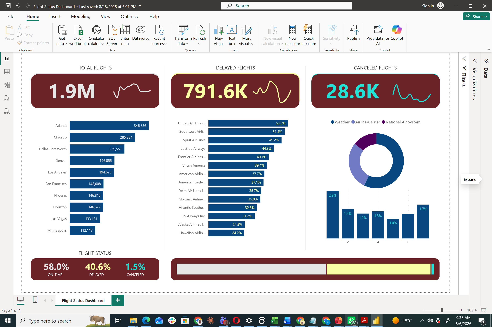

KWADWO ODURO TWUM

BUSINESS ANALYTICS | AI | DATA ENGINEERING | BUSINESS INTELLIGENCE

Turning Data Into Business Value

Building AI solutions • Analysing business problems • Creating data
products • Helping organisations grow through data.

------------------------------------------------------------------------

## ABOUT ME

Hello! I’m Kwadwo Oduro Twum 👋, a Business Analytics professional with
a background in Engineering and Data Analytics. I
specialise in transforming raw data into meaningful insights that drive
strategic business decisions.

My experience spans healthcare analytics, manufacturing, operations,
human resources, finance, business intelligence, and machine learning. I
have designed dashboards, predictive models, ETL workflows, analytical
web applications, and operational systems that improve efficiency and
support executive decision-making.

I have also completed an MSc in Business Analytics and am currently expanding my
expertise in Artificial Intelligence and Data Engineering.

I believe great analytics should do more than explain the past; it should influence what happens next.

------------------------------------------------------------------------

## WHAT I DO

✅ Business & Data Analytics

I analyse complex business data to uncover opportunities, improve
operational efficiency, and support strategic decision-making using
Python, SQL, Excel, and Power BI.

✅ Machine Learning & AI

I develop predictive models and intelligent solutions that help
organisations forecast outcomes, automate decisions, and solve
real-world business challenges.

✅ Data Engineering

I build reliable data pipelines, clean and transform datasets, and
design scalable workflows that power analytics and reporting.

✅ Business Intelligence

I create executive dashboards and KPI reporting solutions that enable
leaders to monitor performance and make data-driven decisions.

✅ Operations Strategy

Leveraging my manufacturing and operations experience, I bridge business
strategy with analytics to optimise processes and drive sustainable
growth.

------------------------------------------------------------------------

## TECHNICAL SKILLS

Languages - Python - SQL - R (Basic)

Analytics & BI - Power BI - Excel - Tableau - Statistical Analysis -
Data Visualisation

Machine Learning - Scikit-Learn - Logistic Regression - Decision Trees -
Random Forest - Clustering - PCA

Data Engineering - PostgreSQL - AWS Redshift - ETL - Data Cleaning -
Data Modelling

Tools - Git - GitHub - VS Code - PyCharm - Streamlit

------------------------------------------------------------------------

## FEATURED PROJECTS

#### • Healthcare Patient Matching System

Designed an intelligent patient matching solution using fuzzy matching
and probability scoring to reconcile patient records across multiple
healthcare systems.

Technologies: Python • SQL • AWS Redshift • Healthcare Analytics

[Read More](https://drive.google.com/file/d/1KVwTR6cWfaagGpTR9GkneffnFj6D2KF1/view?usp=drive_link)

------------------------------------------------------------------------

#### • Customer Churn Prediction

Developed machine learning models that predict customer churn using
Logistic Regression, Decision Trees, and Random Forest algorithms.

Technologies: Python • Machine Learning • Classification

[Read More](https://drive.google.com/file/d/1Qt7GsDi6-Oiyc-4ZBo6rbDHPGOpIFqxb/view?usp=drive_link)

------------------------------------------------------------------------

#### • Marketing Campaign Analytics Dashboard

Built executive Power BI dashboards to monitor campaign performance,
ROI, customer behaviour, and business KPIs.

Technologies: Power BI • DAX • Data Visualisation

[Read More](https://ugedugh-my.sharepoint.com/:u:/g/personal/kotwum003_st_ug_edu_gh/IQAj333_EKZbTo8SF-YwMEHQAeo10BRUIrExrxMEanSRF2s?e=7e8jAx)

------------------------------------------------------------------------

#### • eWOM & Purchase Intention Research

Conducting postgraduate research exploring the impact of Electronic
Word-of-Mouth on purchase intentions using statistical modelling and
machine learning.

Technologies: Python • Statistics • Research Analytics

[Read More](https://docs.google.com/document/d/1VSxtykQ-vdYewKhRAwxBtmH2pzUJXlem/edit?usp=drive_link&ouid=114303194223546344620&rtpof=true&sd=true)

------------------------------------------------------------------------

#### • Manufacturing Operations Analytics

Applied business analytics to improve inventory management, reporting,
production efficiency, and operational decision-making.

[Read More](https://docs.google.com/spreadsheets/d/1u8KGz6Np0TFxCRAVtZMiAztVn88Hgl3K/edit?usp=drive_link&ouid=114303194223546344620&rtpof=true&sd=true)

------------------------------------------------------------------------

#### • Sales Analytics Dashboard

Built workforce dashboards analysing customer turnover, best/worst customers, and
sales performance.

[Read More](https://ugedugh-my.sharepoint.com/:u:/g/personal/kotwum003_st_ug_edu_gh/IQDngDc0j7YxS5mj7yWFl1o4ARxHKXzvuZrnct1tJokUnus?e=fAF4Bw)

------------------------------------------------------------------------
#### • Reward Program Analytics

Applied business analytics to design a rewards program for students to support personal development.

[Read More](https://drive.google.com/file/d/1dHp7lEeM65xLcsfhHXOnQMaKa_CixA5D/view?usp=drive_link)

------------------------------------------------------------------------

#### • Flight Analytics Dashboard

Built a dashboard analysing flight status, flight performance, and
factors surrounding flight operations.

[Read More](https://ugedugh-my.sharepoint.com/:u:/g/personal/kotwum003_st_ug_edu_gh/IQBwccseF4o7Tp1e6pgnWAsbAdcbeDgpOYmB7tlv8dEO9m8?e=NsyuG1)

------------------------------------------------------------------------
## COMMUNITY & LEADERSHIP

-   Facilitator — IndabaX Ghana(Ghana Data Science Summit)
-   Orange Corners Ghana Entrepreneur
-   MSc Business Analytics Researcher
-   AI & Data Analytics Mentor

------------------------------------------------------------------------

## CURRENTLY LEARNING

-   Data Engineering
-   Generative AI
-   MLOps
-   Cloud Analytics
-   AI Agents

------------------------------------------------------------------------

## MY MISSION

To leverage data, artificial intelligence, and technology to solve
complex business problems, improve decision-making, and build innovative
solutions that create measurable impact across industries.

------------------------------------------------------------------------

## CONTACT DETAILS

📧 Email: Kwadwooduro303@gmail.com

📱 Phone: (+233) 24 838 0289

